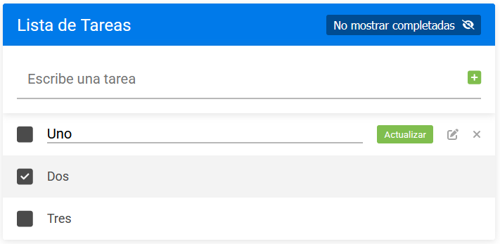

# Proyecto: Desarrollo de una lista de tareas con React

### Objetivo:

Desarrollar un formulario para la gestión de tareas utilizando React que cumpla con las siguientes características:

### **Requisitos Funcionales**

1. **Dar de alta, editar y elimiar tareas:**

   - El usuario tendrá que poder dar de alta una tarea nueva.
   - El usuario tendrá que poder dar poder modificar una tarea existente.
   - El usuario tendrá que poder elimiar una tarea.

2. **Declarar una tarea como completada:**

   - El usuario tendrá que poder declara una tarea como completada para posteriormente poder filtar por tareas completadas y no completadas.

3. **Declaración de componentes:**

   - La aplicación debería estar constituida de los siguientes componentes:
     - App como componente donde incluimos el resto de componentes.
     - Header que incluiye el título del ejercicio y el botón para filtrar.
     - FormularioTareas para poder ingresar nuevas tareas y realizar acciones de modificación y eliminación.
     - Tarea como componente que consituye la tarea.
     - ListaTareas como listado de las tareas existentes.

4. **Uso de iconos con FontAwesome:**

   - Para los iconos, se puede hacer uso de los paquetes de FontAwesome para los iconos.
   - [Documentación](https://www.digitalocean.com/community/tutorials/how-to-use-font-awesome-5-with-react-es)
   - Listado de comandos.
   ```bash
      npm i -S @fortawesome/fontawesome-svg-core @fortawesome/react-fontawesome
      npm i -S @fortawesome/free-solid-svg-icons
      npm i -S @fortawesome/pro-solid-svg-icons
   ```

### **Requisitos Técnicos**

1. **React y Hooks:**

   - Utilizar React con el Hook necesarios para manejar la información y estado de los componentes.

2. **Diseño de Estilos:**
   - Aplicar estilos utilizando CSS, siguiendo el diseño base proporcionado, y asegurardo la legibilidad y flexibilidad de la interfaz.



---

### **Entrega**

1. Subir el código fuente en un repositorio de GitHub y entregarlo comprimido en un archivo ZIP con todo lo necesario para su funcionamiento.
2. Incluir un video o enlace a un video explicando el código y funcionamiento de la aplicación (YouTube, Google Drive u otra plataforma similar). **Este es un requisito obligatorio para la evaluación del proyecto.**
3. Asegurarse de incluir todas las dependencias necesarias en `package.json` y especificarlas en el `README.md`.
4. Verificar que la aplicación funcione correctamente antes de la entrega.
